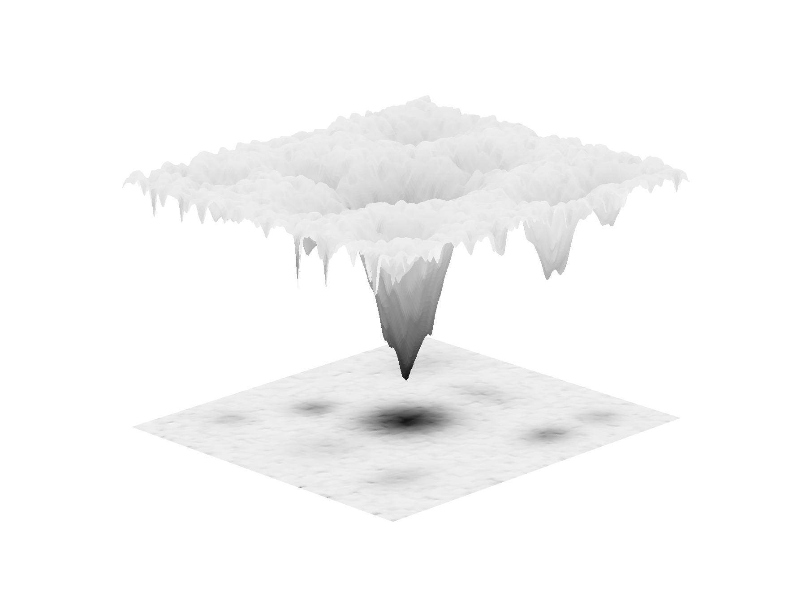

# Python code to make energy landscape figures
This repository has Jupyter notebooks with Python code that we have used to make figures of energy landscapes for journal articles. They all use very similar code, but individual notebooks have slight tweaks to certain functions and parameters that make the unique energy landscapes used in those manuscripts. Use these as starting points to make your own energy landscapes!

## Requirements
* Python (X.YY)
* Matplotlib (X.YY)
* Numpy (X.YY)

## Instructions 
Either load a notebook with Jupyter, or copy/paste the relevant code into your own Python script
